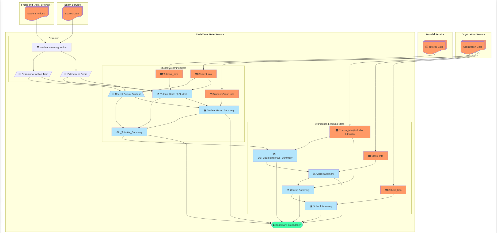

# 实时学习分析系统

Real-Time Learning State Service

---

## 项目概述

实时学习分析统计系统 旨在通过对学生学习行为的实时数据接收、提取和分析，生成多层次的学习状态报告，帮助教育机构更好地理解学生的学习状态与组织学习情况。系统设计分为多个模块，涵盖数据提取、分析、汇总和存储功能，最终生成可供 学生、老师、学校各级领导实时查询和决策支持的学习状态数据。

---

## 使用场景

1. **教育机构**：用于了解学生的学习状态和组织的教学效果。
2. **教师**：用于实时了解学生的学习进度和行为。
3. **学生**：用于查看自己的学习状态和进步情况。

----

## 系统架构

    
该系统主要由**数据接收模块**、**数据整合分析模块**、**数据实时查询模块**三大模块构成：

本系统依赖四个外部系统：
1. **组织服务** (Orgnization Service)：提供组织相关的基础数据。
2. **教程服务** (Tutorial Service)：提供教程相关的基础数据。
3. **前端服务** (Front-end )：提供学生各类操作的基础数据。
4. **考试作业服务** (Exam Service)：提供学生考试、作业的成绩基础数据。

### **1. 数据接收模块**

**功能**：接收学生、老师账号在各个学习系统中的带有用户标识的实时操作日志。

#### **1.1 数据来源**
- **前端服务 (Front-end Service)**：接收来自学生的实时学习行为数据。
- **考试作业服务 (Exam Service)**：接收学生考试、作业成绩的实时数据。

#### **1.2 数据接收流程**
- 数据接收统一通过 **Kafka Topic** 进行流式接入：
  - `Student_Learning_Action`：前端及考试等系统 实时记录的学生学习行为数据。
    - **前端服务 (Front-end Service)**
    - **考试作业服务 (Exam Service)**
- 数据预处理：
  - **Extractor of Action and Time**：解析学生学习行为的时间数据。
  - **Extractor of Score**：解析学生作答的成绩数据。

---

### **2. 数据整合分析模块**

**功能**：基于 Kafka Streams 流式计算框架，完成针对各个组织层级下的学习统计和分析。

#### **2.1 学生学习状态分析**
- **输入数据**：
  - 从 **数据接收模块** 实时接收的学生学习行为数据。
  - 从 **组织服务 (Orgnization Service)** 获取学生基础信息 及 各组组织等基础数据。
  - 从 **教程服务 (Tutorial Service)** 获取教程相关的基础数据。
- **核心数据结构**：
  - `Student_Info`：学生的基础信息。
  - `Tutorial_Info`：教程的基础信息。
  - `Student_Group_Info`(可选)：学生分组的基础信息。
  - `Student_Group_Summary`(可选)：学生分组的学习状态汇总。
  - `Tutorial_State_of_Student`：学生在教程上的学习状态（包括学习时长、作答成绩等）。
  - `Recent_Acts_of_Student`：学生最近的学习行为数据（如最近访问的教程节点、学习时长等）。
  - `Stu_Tutorial_Summary`：学生的单一教程学习状态汇总。
- **输出数据**：
  - `Stu_Tutorial_Summary` (学生层面的学习状态数据，包括学生在教程各级节点上的**学习进度、成绩、学习时长**等)
  - 学生最近访问操作记录列表。

#### **2.2 各组织层级学习状态汇总**
- **功能**：基于学生学习状态数据，按照不同组织层级（学生、班级、课程、学校）进行学习状态的汇总和分析。
- **核心数据结构**：
  - `Stu_CourseTutorials_Summary`：学生在课程下所有教程的学习状态汇总。
  - `Class_Summary`：班级层面的学习状态汇总。(班级下所有课程的学习状态）
  - `Course_Summary`：课程层面的学习状态汇总。(所有选择本课程的班级的学习状态)
  - `School_Summary`：学校层面的学习状态汇总。(所有课程, 所有班级的学习状态)

#### **2.3 数据同步**
- **功能**：将汇总的学习状态数据存储到搜索引擎（如 Elasticsearch）中，便于实时查询和后续分析。
- **核心组件**：
  - `Summary Info Indexer`：将学习状态数据同步到 Elasticsearch 索引中。

---

### **3. 数据实时查询模块**

**功能**：实现各个组织层级下学习统计分析结果的实时查询功能。

#### **3.1 查询功能**
- 提供基于 Elasticsearch 和 RocksDB 的实时查询接口，支持以下查询场景：
  - 查询学生的学习状态（学习进度、成绩、学习时长等）。
  - 查询学生分组的学习状态汇总信息。
  - 查询班级、课程、学校等不同组织层级的学习状态汇总信息。

#### **3.2 查询优化**
- 基于 Elasticsearch 索引设计，优化查询性能：
  - 按组织层级（学生、班级、课程、学校）建立索引。
  - 支持多维度筛选（如时间范围、是否包含详情）。

---

## 数据模型
[实体信息列表](./learning_stats_data_model.md)

---

## 数据实时查询模块API
[API列表](./learning_stats_api.md)

---

## 技术栈

- **后端开发**：SpringBoot, Kafka-Streams (Java)
- **数据库**： RocksDB (Kafka-Streams 自带的 Key-Value存储引擎)
- **消息队列**：Kafka 用于实时数据传输 及 近6个月的关键数据可追诉。
- **索引存储**：Elasticsearch 用于快速查询和分析。

---

## 项目特点与优势

1. **实时性**：支持实时提取学生学习行为数据，生成学习状态报告。
2. **多层次分析**：从学生到小组、班级、课程、学校，提供多层次的学习状态报告。
3. **易维护、可扩展性**：使用Kafka-Streams操作的测试框架, 使用TDD开发流程,覆盖系统主要流程；面向数据的模块化设计，便于扩展新功能。
4. **高效存储与查询**：采用KV存储引擎存储学习状态数据，支持快速查询； 使用Elasticsearch搜索引擎, 支持快速查询和分析.

---

## 部署与维护

**部署环境**：支持华为云云端部署 
    - Kafka Cluster(20 nodes) 
    - K8s

**监控与维护**：
- 性能指标：华为云提供Kafka, Elasticsearch 实时监控数据。
- 业务指标：
    - 实时上报 上传、提取和各状态生成模块 **异常信息** 至飞书群组。
    - 定时上报 上传、提取和各状态生成模块 **统计数据** 至飞书群组。
        - 每时 / 每日 / 每周 / 每月

---

## 结论

实时学习分析统计系统 通过对学生学习行为的实时分析，为教育机构和学生提供了全面的学习状态报告，为教师教学及学校管理工作提供实时的数字化支持，具有重要的应用价值和广阔的市场前景。

